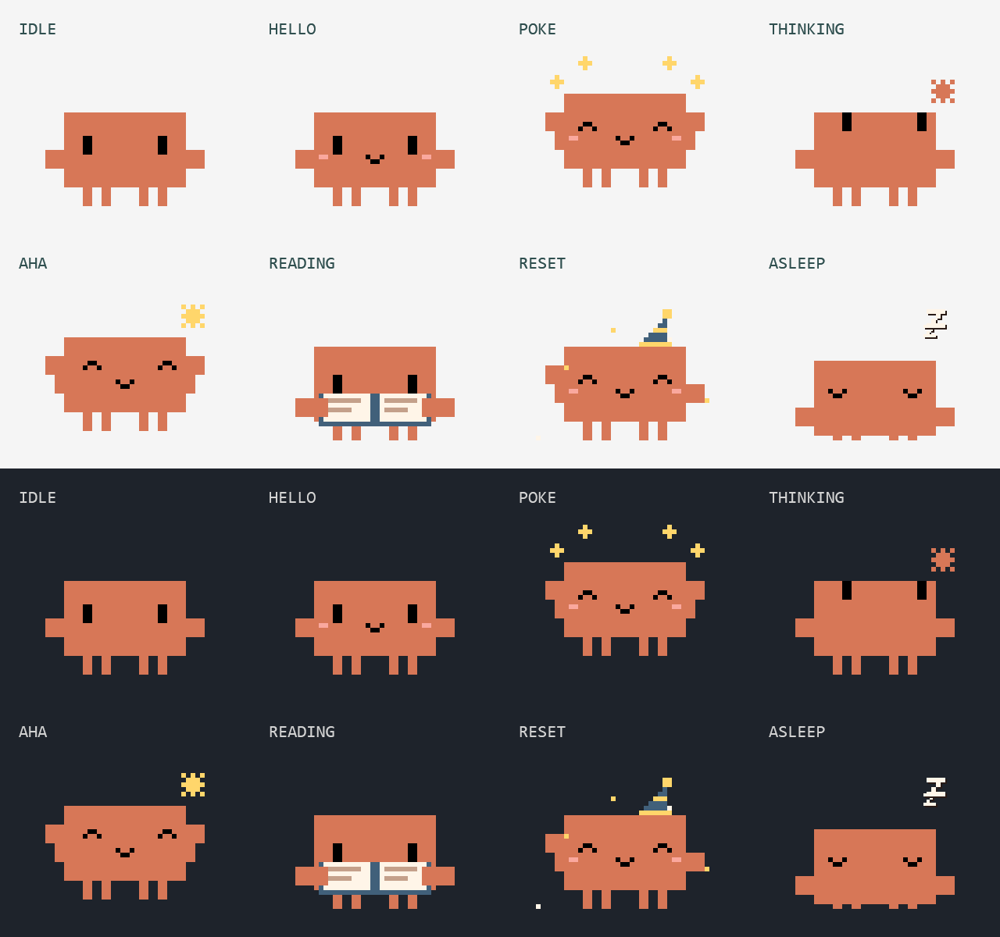
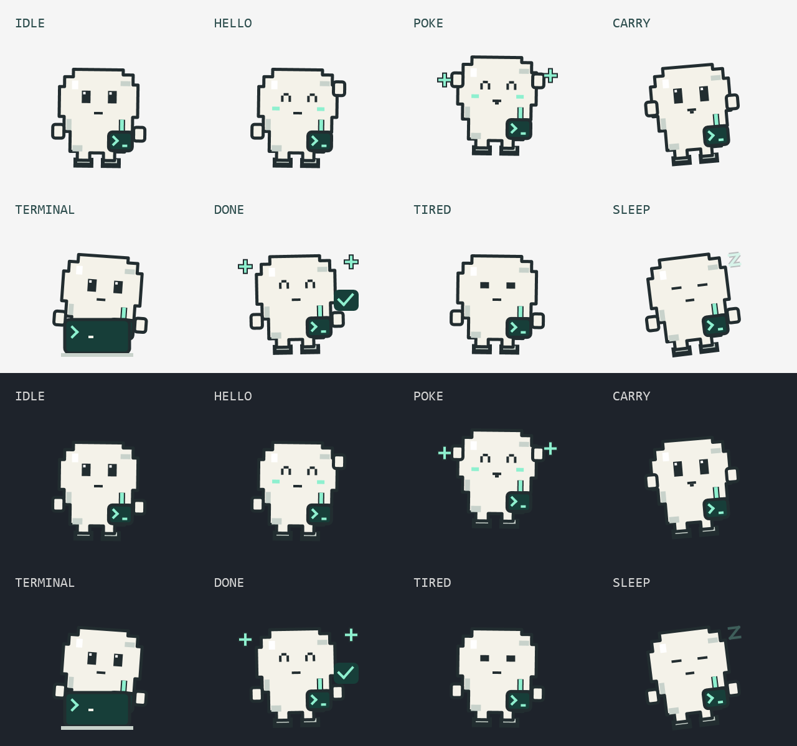

# Taskbar companions

Two little desktop companions for Windows that sit on your taskbar and show how much of your **Codex** and **Claude** plan allowance is left, as RPG-style HP and MP bars. One process, one independent transparent window per companion. Use either one on its own, or both.

- **Codex** is the default blue Codex pet when the Codex extension is installed. Otherwise the little terminal explorer, drawn in this project, comes along in his place.
- **Claude** is Clawd, the pixel critter from Claude Code's terminal banner, redrawn in code.



> **Unofficial fan project.** Not affiliated with, endorsed by, or sponsored by Anthropic or OpenAI. Claude, Claude Code and Clawd are trademarks of Anthropic. Codex and ChatGPT are trademarks of OpenAI.

## Requirements

- Windows 11 (the only version tested).
- The [.NET 10 SDK](https://dotnet.microsoft.com/download/dotnet/10.0) to build.
- For live Codex usage and the Codex pet: the Codex extension for VS Code, VS Code Insiders or Cursor, signed in.
- For Claude usage: Claude Code, signed in with a Pro or Max plan.

You only need the tool for the companion you want. On first start the app shows the companions whose tools it finds (both, if it finds neither); **Settings** changes that.

## Run

```powershell
git clone https://github.com/levi2111/taskbar-companions.git
cd taskbar-companions
powershell -ExecutionPolicy Bypass -File .\launch.ps1
```

`launch.ps1` builds the app into `app\` the first time, then starts it. Run it with `-Rebuild` after pulling changes. You can also start `app\TaskbarCompanions.exe` directly.

There are no prebuilt downloads. The exe you build is unsigned, so Windows Smart App Control or SmartScreen may block it; that's expected for unsigned apps.

- Right-click the running app's taskbar icon and choose **Pin to taskbar**. The characters share one taskbar button and one Alt+Tab entry. Keep the `app` folder in place after pinning.
- Right-click a character and choose **Minimize companions**. The shared taskbar button minimizes and restores them together; launching again restores them without moving them.
- The tray menu also offers **Restore companions**, **Bring companions home**, **Demo usage on / off**, **Settings…**, and **Quit**. Closing a character minimizes all of them.
- **Settings…** (in the tray menu and each character's right-click menu) shows or hides each companion, and says what it found for each: Claude Code's folder, `codex.exe`, Codex's session logs, and the Codex pet's artwork. If Claude Code or Codex keeps its data somewhere unusual, pick the folder (or `codex.exe`) there. **Hide this companion** in a character's right-click menu hides it straight away; the last one showing can't be hidden.
- Drag a character or its bars to move it. **Sit on taskbar** toggles docking; **Return home** resets placement.
- Each character has two floating tracks: green HP for weekly allowance remaining, blue MP for the short (five-hour) window. Inside each bar is the time until that window resets. HP shows whole days ("5d") until three days remain, then "2d 4h", "9h", and "4h 12m" under five hours. MP shows "2h 13m". Hover a bar for details and where the data came from; hover a character for one of its lines.
- When a window resets, its bar drains and pours back full with a shine, and the character celebrates. **Preview reset celebration** in the right-click menu plays it on demand.
- Unknown usage leaves the bars empty. **Demo usage on / off** shows sample values, and the hover details say so.
- Fullscreen apps temporarily hide the companions without minimizing them.

Settings, saved positions and bridge files live in `app\data`.

## The characters

### Codex

**The Codex pet.** Its artwork belongs to OpenAI and is **not included in this repository**. At startup the app looks for `codex-spritesheet*.webp` inside the Codex extension you have installed (`~\.vscode\extensions\openai.chatgpt-*\webview\assets\`, and the same under `.vscode-insiders` and `.cursor`) and reads it from there, using Windows' built-in WebP support. If the sheet is missing, can't be decoded, or has an unexpected layout, the terminal explorer comes instead.

He breathes gently with his feet planted, blinks every eight seconds, and occasionally pauses in a thoughtful pose. Hovering gives a smile and a slight lean toward the pointer. Clicking gives a little nod, a short wave, then a smile. While dragged he holds a scrunched expression and sways gently; releasing him gives a soft squash and recovery. Every 90 seconds he spends 24 seconds with his laptop. Low energy selects a resting expression. An allowance reset earns a jump, a happy bounce and a wave, with cyan sparkles.

**The little terminal explorer.** An ivory pixel explorer with a mint terminal satchel and tiny boots, drawn entirely in code (`TerminalExplorer.cs`). He waves when hovered, hops with sparkles when poked, types at a pretend terminal every so often, and naps when energy runs out.



These are local animations, not indicators of what Codex is actually doing.

### Claude: Clawd

Rebuilt in `Clawd.cs` from Claude Code's block-character art. Each terminal quadrant becomes a 6×12 pixel block, rendered without anti-aliasing; expressions use a finer 3-pixel grid.

- **Watches the pointer.** Its eyes follow the mouse while it moves, then wander.
- **Has a routine.** Every 24 seconds it pauses to think, looking up at a pixel version of Claude Code's `· ✢ ✳ ✶ ✻` spinner, then hops at a gold "aha" star. On alternate rounds it holds up an open book and reads.
- **Responds to you.** Hover it and it smiles, blushes and waves. Click without dragging to poke it: it crouches, hops and gives off gold sparkles. Drag it and it flails and kicks, then crouches on landing.
- **Is honest about energy.** Mood follows the lower of HP and MP. At 20% or less it gets drowsy, with heavy lids, drooping arms, and the odd yawn. At 0% it sits down to sleep with floating Zs, and a poke only startles it awake for a moment.
- **Celebrates resets.** It springs awake, a striped party hat drops onto its head, and it hops under a gold star, then waves while sparkles fall.

## Where usage comes from

Nothing here sends a message or spends allowance. If a source has gone quiet, the bar tooltip says how old the data is, for example "as of 1h 20m ago".

### Codex (ChatGPT plan)

- **Codex App Server (live).** The app starts the official [App Server](https://learn.chatgpt.com/docs/app-server) (`codex.exe app-server`: the one chosen in Settings, or from `CODEX_PATH`, the Codex extension, or `PATH`) hidden in the background. It asks `account/rateLimits/read` once a minute and three seconds after a reset. This is the same read-only call the Codex app uses. The App Server signs in with Codex's own login and talks to OpenAI itself; this app never handles your Codex credentials.
- **Codex session logs (local).** Between polls, and whenever the App Server is unavailable, the app reads the `rate_limits` Codex writes after each reply under `%USERPROFILE%\.codex\sessions` (or the Codex folder chosen in Settings, or `CODEX_HOME`), whichever is newer.
- Both use the `codex` bucket and classify windows by duration: under a day is MP, a day or more is HP. With neither available, the app falls back to `app\data\codex.usage.json` (see [Other sources](#other-sources)).

### Claude (Pro/Max plan)

By default, Claude usage comes only from local files:

- **Claude Code's own cache.** Claude Code stores its latest usage reading in `~\.claude.json` (or in the Claude Code folder chosen in Settings, or under `$CLAUDE_CONFIG_DIR`). The app reads only that entry, so it's as fresh as Claude Code's last check.
- **Status line bridge.** `bridge/claude-statusline.js` is a Claude Code [status line](https://code.claude.com/docs/en/statusline) command. Claude Code passes it `rate_limits.five_hour` and `rate_limits.seven_day` after the first response of a session. It prints `Opus · 5h 24% · 7d 41%` in Claude Code and atomically writes `app\data\claude.usage.json`. It needs [Node.js](https://nodejs.org/). Enable it in `~\.claude\settings.json`, replacing the path with where you cloned this repo:

  ```json
  "statusLine": { "type": "command", "command": "node \"C:/path/to/taskbar-companions/bridge/claude-statusline.js\"" }
  ```

  It only updates while a terminal Claude Code session is responding; the VS Code extension does not run status line commands. Usage on claude.ai counts toward the same limits but only shows up the next time Claude Code responds.

**Live account usage (opt-in, off by default).** Right-click Claude and tick **Live account usage** to also poll, every two minutes, the endpoint behind Claude Code's `/usage` screen (`GET https://api.anthropic.com/api/oauth/usage`). For this, the app reads the login token Claude Code stores in `~\.claude\.credentials.json`. The token is sent only to `api.anthropic.com` and is never logged, written, or refreshed. Please be aware:

- The endpoint is **undocumented** and may change or stop working at any time.
- It reuses Claude Code's subscription login from a third-party app. Check [Anthropic's terms](https://www.anthropic.com/legal/consumer-terms) and decide for yourself before turning it on.
- If the stored login has expired because Claude Code hasn't run for a while, the tooltip says so; open Claude Code to renew it.

The setting is remembered in `app\data\claude.position.json`.

### Other sources

Any tool can publish usage by writing JSON files into `data` **beside the executable** (`app\data`), named `codex.usage.json` and `claude.usage.json`:

```json
{
  "weekly": { "remainingPercent": 76, "resetsAt": "2026-09-25T18:00:00Z" },
  "session": { "remainingPercent": 48, "resetsAt": "2026-09-22T18:00:00Z" },
  "updatedAt": "2026-09-22T15:00:00Z"
}
```

Percentages range from 0 to 100; null means unknown. Use ISO-8601 timestamps with time zones, and write with an atomic file replacement to avoid partial reads. The app polls every second and notes the data's age after five minutes. Once a window's `resetsAt` passes, it shows that window as full, because a reset clears usage until the next request starts a new window. `session` means the provider's short quota window, not a chat session. There's a sample in `examples/`. You can also implement `IUsageProvider` in code.

## Privacy and network access

- **Reads locally:** Codex session logs, the usage entry in Claude Code's `.claude.json`, and the bridge files in `app\data`.
- **Starts:** `codex.exe app-server`, which talks to OpenAI with Codex's own login.
- **Connects to the internet itself:** only when you turn on Claude's **Live account usage**, and then only to `api.anthropic.com`.
- **Writes:** only inside `app\` (saved settings, self-test results), plus short-lived temp files during `--self-test`.

No telemetry, no other network access, and no NuGet packages (`NuGet.Config` clears all package sources).

## Code tour

- `Characters.cs`: character definitions (names, colors, dialogue, drawing callback) and the `CharacterFrame` each drawing receives: time, pointer gaze and attention, hover, poke, drag, reset and energy. A drawing may ignore any of it.
- `Clawd.cs`: Claude's appearance and behavior.
- `CodexCompanion.cs`: the Codex pet, and loading its artwork from the installed extension.
- `TerminalExplorer.cs`: the terminal explorer.
- `CharacterView.cs`: animation clock, pointer and hover tracking, dialogue tooltips.
- `Usage.cs`: usage providers, the JSON bridge, freshness and countdown formatting.
- `CompanionWindow.cs`: each companion's window, floating bars, menus and saved position.
- `Settings.cs`: which companions show, where Claude Code and Codex keep their data, and detecting them.
- `SettingsWindow.cs`: the Settings window.
- `Desktop.cs`: monitor positioning and fullscreen detection.
- `App.xaml.cs`: process lifetime, single instance, tray menu, and opening a window for each companion shown.

## Build and checks

```powershell
dotnet build TaskbarCompanions/TaskbarCompanions.csproj --configfile NuGet.Config
```

- **Logic checks:** run the built exe with `--self-test`. It writes `checks.txt` beside the exe and exits with 0 on success, 1 on failure. It covers countdown boundaries, data freshness, malformed JSON, quota bounds, Codex log and App Server parsing, Claude usage parsing, bar labels, reset refills, fullscreen versus maximized geometry, and the Codex artwork fallback and transparency, and choosing companions and folders.
- **Startup smoke check:** run with `--smoke-test`. It opens the companions the settings show alongside any running copy, checks the shared taskbar entry and minimize/restore, renders `codex.preview.png` and/or `claude.preview.png` mid reset celebration, writes `desktop-checks.txt`, and exits after about four seconds.

## Scope and known limits

Taskbar docking targets the bottom of the chosen monitor's work area (Windows 11's standard bottom taskbar). Fullscreen detection uses foreground-window geometry, not game hooks. Auto-hidden or side taskbars, mixed-DPI multi-monitor setups, games with unusual window bounds, and virtual desktops are largely untested. The app adds no startup entry.

## License

[MIT](LICENSE) for the code, including the drawings made in code (Clawd's rendering and the terminal explorer). The Codex pet artwork is OpenAI's; it is not part of this repository or covered by its license.
